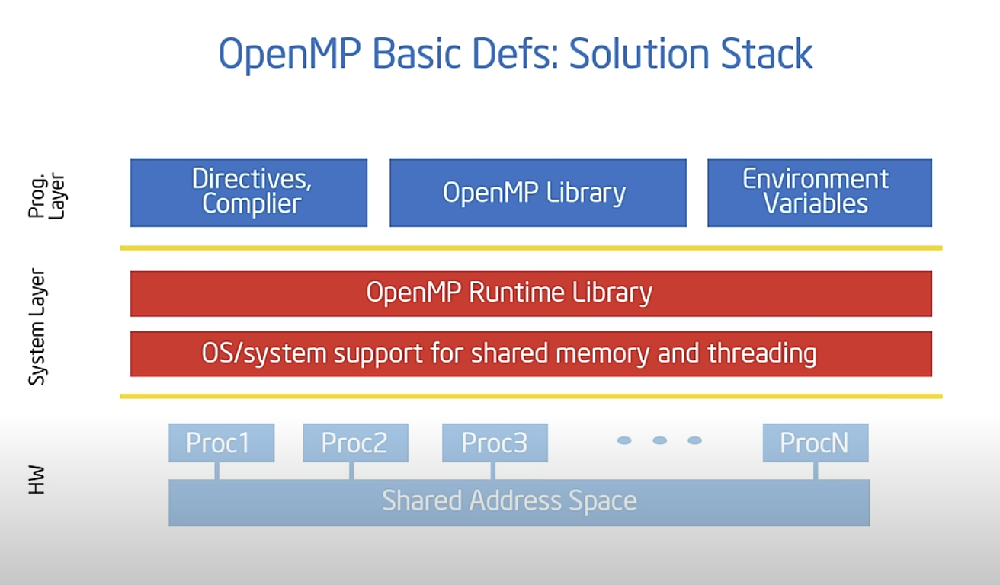
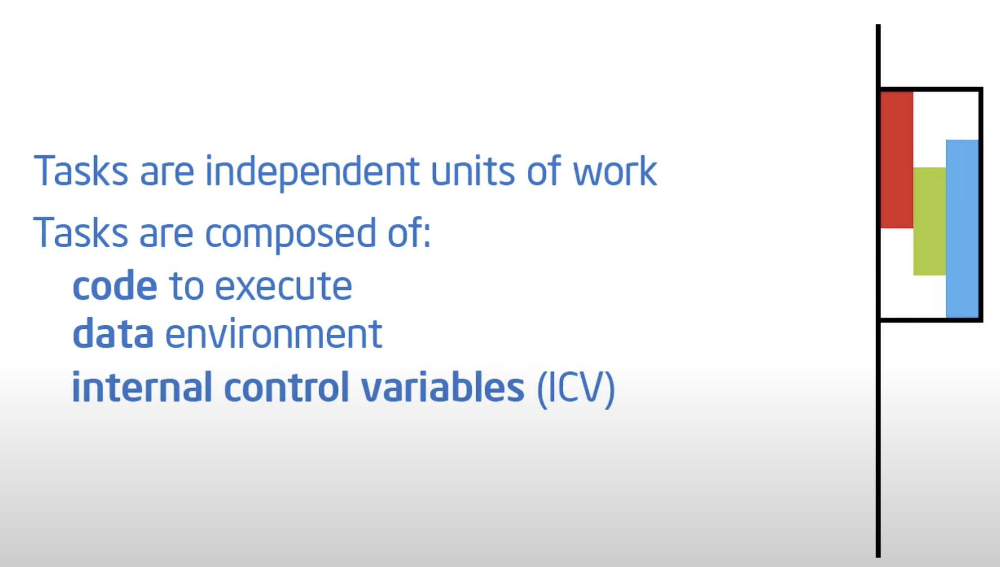
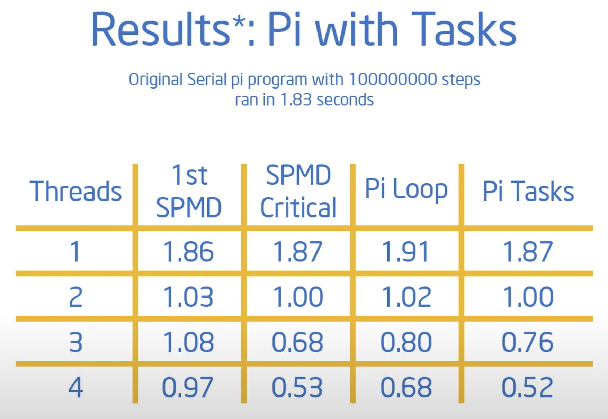

W = CV^2
POWER = W*f
POWER = CV^2f

Concurrency: a condition of a system in which multiple tasks are logically active at one time 
Parallelism: a condition of system in which multiple tasks are active at one time

risolvere un sisitema line are (puo non essere concorrente ma puo usare il parallelismo per eseguire il compito piu velocemente.)
vs 
web server (concurrent by default)

in the image is missing the user layer

Direttive al compilatore e al preprocessore.
#pragma omp contruct[clause[clause]..]
#pragma omp parallel num_threads(4)

#include <omp.h>

molti dei costrutti openMP si applicato a blocchi detti "Structured Block" che sarebbero blocchi di codice da cui una volta che entri non esci se non dalla fine. Non è possibile saltare al centro del blocco o dal centro del blocco all' esterno.

HANDS ON :
to compile with GNU linux an openMP code just run:
gcc -fopenmp foo.c

in bash Shell puoi selezionare il numero di thread da usare per eseguire un programma scritto per openmp:
export OMP_NUM_THREAD=4

OMP suppose that you have a Shared Memory machine
There are 2 kind of shared memory machine:

Symmetric Multiprocessor (SMP):
assume che tutta la memoria e tutti i processori siano uguali non c'è differenza alcuna fra processori ne tempi di accesso in memoria

Non Uniform Memory Access (NUMA) :

poiche ci sono livelli di cache diversi 

I processi nel sistema operativo sono rappresentati in memoria così e poichè i thread hanno l'HEAP condiviso (ma non lo stack) con gli altri e il cambio di contesto risulta molto efficiente.

 
see helloworld that shows tha problem of the race condition. To avoid it should sinchronize the thread that is expensive. Too much sinchronization results in no permormance achievement. Bisogna sinchronizzare quanto meno possibile e per farlo bisogna fare attenzione ai dati e variabili condivise.

4 basic catecories presenti in Open MP 
- creare thread che lavora in uno ambiente shared adresss
- unintendetd shared per evitare casini con le variabili e le races condition
- sinchronization to have organized e disciplined way to access ai dati shared
- organizzare i dati in modo da cercare di ridurre al minimo la sinchronizzazione 

## Costrittu di OpenMP

Creazione di thread in OpenMP:
modello Fork-Join-Model -> praticamente lo stesso di quando accade usando pthread

Quando un processo è in esecuzione questo teocicamente puo creare un set di thread che prendono il nome di thread team. Questo thread of team lavora assieme in condivisione della memoria ed esposto a RC ecc finche poi non si riunisce nello stesso processo di nuovo. Questo processo puo essere ripetuto per ogni pezzo di programma che richide l' azione di piu thread per essere eseguito efficientemente.

ogni thread in generale puo creare altri thread se il sistema ha capacità.

Per fare il fork e creare altri thread in OpenMP si fa UNICAMENTE con la direttiva: 
#pragma omp parallel 

se non c'è nel codice allora tutto è fatto nello stesso thread.

omp_set_num_thread(4);
richiede 4 thread ma non li crea è la direttiva #pragma omp parallel che li crea effettivamente

#pragma omp parallel
{
    int ID = omp_get_thread_num();
    pooh(ID,A);
}

facendo così ogni thread creato con pragma eseguirà il codice all interno delle parentesi.

Dal punto di vista della mamoria tutto ciò che è allocato dentro le parentesi è allocato all nello stack privato del singolo thread mentre tutto ciò che è allocato fuori è allocato (diciamo )nello HEAP ed è condiviso.

Quello che fa openMP è prendere il codice e convertirlo in una funzione in questo caso di nome thunk come nell esempio:

astraendo i dettagli di utilizzo della libreria POSIX thread.

Lo snippet 1 mostra come se il problema è parallelizzabile e non c'è dipendenza fra le operazioni da eseguire è possibile splittare il lavoro fra i thread in funzione del ID, raccogliere i risultati in un array e poi comporre il tutto a posteriori senza usare variabili condivise. Questo è anche un modo di ridurre la sincronizzazione a spesa dell uso di piu memoria.

ATTENZIONE:
Lo shnippet 1 produce su alcune architetture il seguente problema:
in codice non parallelo impiega: 1.83s  

é possibile notare che l introduzione di overhead da parte di OpenMP incrementa il tempo di prestazione nel caso di singolo thread. Mentre comparando il caso con 2 thread e quello con 3 thread si nota un fenomeno di inversione, il tempo aumento con 3 thread anzichè diminuire come ci si aspetta. 

Questo fenomeno prende il nome di Fake Sharing.  

Questo fenomeno è legato al fatto che effettivamente la memoria non è tutta condivisa ma esistono diversi livelli di cache che si sincronizzano garantendo il risultato finale e questo fa si che la scalabilità del programma fallisca. 

Un principio della programmazione parallela recita che è bisogna garantire che i thread scrivano e leggano su dati diversi in modo che questi dati possano esser portati in cache senza dare problemi di sincronizzazione.

Lo snippet 2 mostra come risolvere il problema del fake sharing trasformando un array in una matrice.

Tuttavia il codice proposto è verboso e articolato e dunque si cerca una soluzione molto piu elegante.

Flussi di esecuzione e sinchronizzazione:

High Level sinchronization:
    - Barrier 
        at some point all thread stop and wait till everyone arrive.
        > #pragma omp barrier
        all thread should reach the barrier before to continue.
    - Critilcal
        implement a mutual exclusion
        thread can execute the code just one at a time.
        > #pragma omp critical {}
        just one thread can go forward 
    - Atomic
        > #pragma omp atomic
        for keep it simple: ci sono certi costrutti supportati in hardware che permettono una efficiente mutua esclusione, se ci sono usali se no usa una Critical section in genere usati per semplici operazioni come incrementi o decrementi
    - Ordered

Low Level sinchronization:
    - flush
    - Locks (simple and nested)

Esercizio 3
Nello snippet 3 il si mostr come usare le primitive omp per risolvere il problema del fake sharing. Attenzione a non sincronizzare all interno dei cicli cosa che risulta particolarmente inefficiente!

Fin ora i programmi trattati sono nel paradigma stesso calcolo, dati multipli da dividere sui core.(SPMD)

Work Sharing:

- sections/Section construct
- single contruct
- task construct

->> loop construct
"#pragma omp for" messo prima di un loop for divide l onere del loop sui thread senza doverlo fare manualemnte splittando il carico con l' id dei thread come fatto prima. In questo modo il codice scritto è molto piu piccolo e leggibile. 
Bisogna tenere a mente che il compilatore è stupido e che bisogna guidarlo su come splittare il lavoro sul threads.
Questo di fa con lo scheduling.

- schedule static[chunk size]: le iterazioni in chunk e splitta su diversi threads se metti anche il chunck size, viene fissato il valore dei blocchi e i blocchi di dati vengono assegnati round robin ai thread esistenti. decisioni prese a compile time come gestire i thread 

- schedule dynamic[chunk]: trasforma le iterazioni in task che vengono prese dai thread ed eseguite. Le decisioni prese sono quindi a runtime. Se viene definito il chink si riferisce al numero di iterazioni in blocco.

- schedule guided[chunk]: non used very often 

- schedule runtime: si passa schedule e chunck size a runtime env_variable o runtime library routines.

- schedul auto: è nuovo e si affida al compilatore per prendere tutte le decisione per le massime performance 

schedule e dinamy cono i piu usati .

-> Static: quando posso predire il carico per singola iterazione.
-> dynamic: quando non so quanto l'iterazione puo impiegare in termini di tempo.

Sintatticamente bisogna creare un blocco #pragma omp parallel{} e all interno di esso #pragma omp for. OMP supporta sintatticamente la sintassi unita #pragma omp parallel for che fa la stessa cosa.

Tutto quel che è stato visto fin ora suppone che i cicli in un loop siano del tutto indipendenti. 

Vediamo ora il caso di dipendenze fra iterazioni nel cicli.

In alcuni casi queste dipendenze possino essere riscritt in modo che non vi siano dipendenze per esempio :

int i, j, A[MAX];
j = 5;
for (i=0; i<MAX; i++) {
    j += 2;
    A[i] = big(i);
}

puo essere riscritto in : 

int i, j, A[MAX];
#pragma omp parallel for
for (i=0; i<MAX; i++) {
    int j = 5 + 2*(i+1);
    A[i] = big(i);
}

Quindi la soluzione è :
-> trovare gli elementi di dipendenza. 
-> riscrivere il codice in modo che le singole iterazioni siano del tutto indipendenti 
-> usare il costrutto #pragma omp parallel for

Introduciamo il concetto di "reduction" utilizzando il calcolo del valor medio.
La "reduction" nella programmazione parallela è un concetto utilizzato per combinare i risultati ottenuti da diversi thread o processi in modo da ottenere un risultato unico.
risultato dato da valori accumulati leggendo i dati magari da una struttura dati e poi combinando i risultati.

double sum=0.0,A[MAX]; int i;
for (i=0; i<MAX; i++) {
    sum += A[i];
}
sum = sum/MAX;

Nell esempio la somma totale è data dalla combinazione delle somme parziali calcolate dai singoli thread in caso si voglia eseguire questo codice su piu thread.

Per usare la reduction con OMP devi aggiungere allo statement reduction e fra parentesi la variabile risultatte dalla riduzione e l'operazione di combinazione .

Questo approccio crea una copia della variabile definita come riduzione per ogni thread e inizializzala con l identità dell operazione che dovrà essere fatta. per esempio 0 per l operatore + e cosi via:

il codice diventa : 

double ave=0.0, A[MAX]; int i;
#pragma omp parallel for reduction(+:ave)
for (i=0; i<MAX; i++) {
    ave += A[i];
}
ave = ave/MAX;

Tabella operatori identità supportati per la riduzione: 

Esercizio 4
prendi lo snippet1 del pi e con for e reduction calcola pi

4.1 
test delle diverse possibilità di scheduling

Where Barriers are implied and where explicit ? 

->punto di creazione threads
#pragma omp parallel shared (A, B, C) private(id)
{
    id=omp_get_thread_num();
    A[id] = big_calc(id);
    #pragma omp barrier
    #pragma omp for
    for(i=0; i<N; i++) {
        C[i] = big_calc3(i, A);
    }
    #pragma omp for nowait
    for(i=0; i<N; i++) {
        B[i] = big_calc2(C, i);
        A[id] = big_calc4(id);
    } -> non avrebbe senso mettere una barriera qui perchè i thread subito dopo saranno cancellati quindi perchè tenerli attivi in attesa ? 
}
-> punto do collasso threads 

Alla fine di un costrutto parallelo di loop c'è una barrieta imlicita perche è la soluzione piu sicura tuttavia queste possono essere bypassate se esplicitmante specificato per aumentare le prestazioni se lo si fa in modo sicuro ma è responsabilità del programmatore farlo esplicitamente.

si fa con "#pragma omp for nowait" alla in inizio del loop come nel caso del secondo loop visto che non vengono usati i prodotti calcolati all interno del ciclo.

#pragma omp barrier è invece una barriera esplicita che non c'è modo di bypassare.

essite un costrutto che si chiama master :
#pragma omp master
{
    questo codice verrà eseguito solo dal master
}
non c'è sincronizzazione gli altri thread continuano quello che stavano facendo 

#pragma omp parallel
{
    do_many_things();
    #pragma omp master
    {
        exchange_boundaries();
    }
    #pragma omp barrier --> se voglio che gli altri thread aspettino per vedere il risultato calcolato dal master
    do_many_other_things();
} ---> implied barrier and thread destruction

single invece ha sincronizzazione.

#pragma omp single
{
    il primo che è libero farà questo lavoro
} ---> implied barrier and thread destruction

#pragma omp parallel
{
    do_many_things();
    #pragma omp sigle
    {
        exchange_boundaries();
    } ---> implied barrier
    do_many_other_things();
} ---> implied barrier and thread destruction

no wait puo essere usata anche con "#pragma omp single" e il programmatore si prende la responsabilita 
in genere i costrutti i work sharing hanno una barriera alla fine del blocco per default

Costrutto SECTIONS :

Non usato molto ma vediamo il costrutto section
esistono sections plural e sections sigle :
permette di creare sezioni di codice da assegnare ad un thread o ad un altro e così via.

esempio:

#pragma omp parallel
{
    #pragma omp sections
    {
        #pragma omp section
        x_calculation();
        #pragma omp section
        y_calculation();
        #pragma omp section
        z_calculation();
    }
}

l assegnazione dei thread è automatica non manualmente assegnata. Ogni sezione è assegnata ad un thread separato.

COSTRUTTO PER LA SINCRONIZZAZIONE A Bsso livello 
LOCKS ROUTINES:

- omp_init_lock()
- omp_set_lock()
- omp_test_lock() utile per non aspettare perche la set è bloccante
- omp_unset_lock()
- omp_destoy_lock()

Per spiegare l' uso del lock passiamo ad un problema pratico supponiamo di avere un istogramma. e di voler eseguire un update di questo istogramma in modo efficiente. 
Potremmo definire un lock per ogni elemento dell' istogramma e aggiornare ogni singolo elemento separatamente deifnendo un lock per ciascun elmento. un esecmpio di questo comportamento è riportato nel codice seguente:

#pragma omp parallel for
for(i=0; i<NBUCKETS; i++){
    omp_init_lock(&hist_locks[i]);
    hist[i] = 0;
}

#pragma omp parallel for
for(i=0; i<NVALS; i++){
    ival = (int) sample(arr[i]);
    omp_set_lock(&hist_locks[ival]);
    hist[ival]++;
    omp_unset_lock(&hist_locks[ival]);
}

for(i=0; i<NBUCKETS; i++){
    omp_destroy_lock(&hist_locks[i]);
}

Library routines:

Esistono diverse runtime library che supportano openMP quello che succede è che quando si usano le direttive pragma si dice al compilatore di fare qualcosa per conto nostro. quindi qualcosa che accade a tempo di compilazione ma esistono anche delle cose che succedono a tempo di runtime per forza e quindi parte della runtime library routines alcune di queste le abbiamo già viste come epr esempio: 

- omp_get_num_threads()
- omp_set_num_threads()
- omp_get_thread_num()
- omp_get_max_threads()

esiste un altra funzione che ti dice se  ti trovi in una parallel reagion oppure no.

Questa funzionalità è importante in quei contesti dove ho una funzione che puo essere chiamata in un contesto parallelo o no in modo da adattarne il comportamento.
tale funzione è omp_in_parallel()

Setta la modalità dinamica di gestione dei thread.
omp_set_dynamic()
omp_get_dynamic()
omp_num_procs()
quando si scrive un algoritmo non si sà dove andrà a girare oltretutto per diversi motivi è possibile che la modalità dinamica crei diverse moli di thread in funzione di troppe cose e quindi raccogliere informazioni e disabilitare dinamicamente la modalità dinamica è importante per garantire che per esempio esiste un thread per ogni core.

esempio:

#include <omp.h>
void main()
{
    int num_threads;
    omp_set_dynamic(0);  --> disabilita la modalità dinamica
    omp_set_num_threads(omp_num_procs());
    #pragma omp parallel
    {
        int id=omp_get_thread_num(); --> questa istruzione va messa qui e non dopo la set perche nella set un thread è in esecuzione perche si sta fuori dalla regone parallela
        #pragma omp single
        num_threads = omp_get_num_threads();
        do_lots_of_stuff(id);
    }
}

ENVIRONMENT VARIABLES:

servono a cambiare il comportamento di un programma senza ricompilarlo:

- OMP_NUM_THREAD=int_literal: quanti thread uso di default

In produzione è sempre meglio lasciare queste decisioni alle varibili di ambiente.

Quando si lancia un programma multi thread questo inizia a creare thread che occupano spazio nello stack con le loro variabili locali che possono crescere indefinitamente. questo può portare alla saturazione della memoria e a far collassare l intero sistema operativo. 
è possibile creare un thread dichiarando a priori una dimensione da allocare nello stack e questo si fa con la variblie:

OMP_STACKSIZE: che dice quanto spazio occorre per poter creare un thread

OMP_WAIT_POLICY: quando si è in presenza di barriere o locks si è detto che i thread aspettano il loro turno. esistono diverse policy per la gestione di questa attesa:
principalmente:
-> ACTIVE: corrisponde ad uno spinlocks che consuma risorse
-> PASSIVE: muovi il thread a SLEEP

Sospendere un thread e riprenderlo è oneroso quindi se si sa che si attenderà poco allora forse è meglio non sospenderlo. come nel caso di un istogramamma.

OMP_PROC_BIND=TRUE/FALSE: in genere non si ha a che fare con sisitemi SMP ma con sisitemi NUMA e questa opzione permette di eseguire un bind del thread sul core in modo che non venga spostato su un altro thread questo evita che si finisca in una situazione in cui i dati vengano caricati sulla mamoria piu vicina ad un core e poi il thread venga passato su un altro core aumentando i tempi di risposta della mamoria specialemnte se molti sono i dati da tenere il cache. In caso contrario il movemnto verso un thread piu libero non è una cattiva idea.

Storage attributes:

SHARED
PRIVATE
FIRSTPRIVATE
LASTPRIVATE
DEFAULT(PRIVATE|SHARED|NONE):comportamento di default desiderato quindi una modifica del valore di default se imposto NONE invece il compilatore esige che sia specificato esplicitamnte quindi buono per debuggare

Il default non in C non è applicabile(?)7:00 vid 12

Vediamo ora un esempio SBAGLIATO dell uso di queste clausole:

void wrong() {
    int tmp = 0;
    #pragma omp parallel for private(tmp)
    for (int j = 0; j < 1000; ++j)
        tmp += j;
    printf("%d\n", tmp);
}

private su tmp crea copie locali ma non inizializza il valore di tmp !!
oltretutto se stampo dopo la regione parallela il valore di tmp torna ad essere zero perche si ritorna al contesto precedente

il problema dell inizializzazione si risolve con l uso di firstprivate esempio :

incr = 0;
#pragma omp parallel for firstprivate(incr)
for (i = 0; i < MAX; i++) {
    if ((i % 2) == 0) incr++;
    A[i] = incr;
}

nel codice il calore di incr è inizializzato al valore globale 

Invece lastprivate prende il valore dell ultima iterazione del loop prima del collasso dei thread e lo copia nello scope globale
esempio:

void sq2(int n, double *lastterm)
{
    double x; int i;
    #pragma omp parallel for lastprivate(x)
    for (i = 0; i < n; i++) {
        x = a[i]*a[i] + b[i]*b[i];
        b[i] = sqrt(x);
    }
    *lastterm = x;
}

La stessa variabile in multiple clausole non va messa eccetto un caso:
L' unico caso di applicazione di clausole multiple è in cooperazione con firstprivate e lastprivate.

combinazioni possibili: 
- private e lastprivate 
- prstprivate e lastprivate

7:00 vid 12

ESERCIZIO 5

osservazioni 
- i è automaticamente privato ma non j nel secondo for
- 

UNIT 4 TASKS

Un task è un concetto generale è un unità di lavoro. che vienen creata e messa in una coda per poter essere eseguita appena sia possibile. possibilmente tutti insieme.
Un task è composto da:
- del codice
- dei dati 
- delle variabili di controllo (numero di thread ecc)

In openmp ci sono delle funzioni che definiscono l ambiente di esecuzione 
Il binding dell ambiente in cui si esegue il codice non avviene a livello di thread ma a livello di task.

#pragma omp task 

#pragma omp taskwait

snippet 8 

ADVANCED TOPIC:
FORMAL MEMORY MODEL OF OPEN MP

Describes the detail rules for the consistency of the data seen by each thread in time.
ha a che fare con thread che condividono dati e ci lavorano sopra

supponiamo che il processore 1 vuole il valore della variabile "a" quale vedrà il processore 1 ? 

preso un programma ci interessa l' ordine di lettura scrittura e il loro ordine questo perche il compilatore riordina queste operazioni per una questione di ottimizzazione. 

Il compilatore non sa parallelizzare il codice ma sa riorganizzare le linee di codice.

ora lo lancio su una macchina che lavora con piu core e thread e quello che succede è che a seconda dello stato della macchian queste operazioni nei thread vengono sospese con i thread e riesumate e quindi l ordine è davvero molto complesso da poter stabilire. Questo perche è il sisitema operativo a runtime accende e spegne thread dopo che il compilatore ha generato il codice ordinato ottimizzato.

quindi esisite l ordine del codice
quello del compilatore e 
quello di esecuzione effettiva

Quando si parla di regole di consistenza della memoria non si intende solo la lettura del valore della cache pittosto che dalla dram.

Quindi questa branca ti da le regole e gli stumenti per controllare l ordine di uqeste esecuzioni.
ordine di 
Read
Write
Sinchronization

definisce se e quando il compilatore può eseguire ottimizzazione rispetto a queste 3 operazioni.

Sequential consistency:
 è quello che pensi avvenga nell esecuzione del programma l ordine di RWS in cui io li ho messi nel mio programma e tutti i thread vedo tutto nell ordine definito da me.

ma questo riduce drasticamnete le prestazioni del mio computer.

La soluzione migliore è detta 
Relaxed SEQ Concistancy: 
openMP supporta quest ultima. pupo cambiare per isngolo thread le istruzioni ma non lo puoi fare con l operazione di sisnchronizzazione. 

you cant change R and W on a single threads (?)

-> you cant move thngs around a sinchronization operation.

the sync operation of which we speack about is flush

at this point (the flush one) you are guaranteed to see a consistent view of memory for the flush set that is the collection of variable that flush take as argument id you dont give any argument is making consistent all the memory.

before and anfter flush the compiler can reorder the operations to optimize.

this are the rule of the relaxed consistency. 

#pragma omp flush (variable)

That sound like a fenze but flush most of the time is equivalent to a fence.

from thread perspective my view now available no anyone else not a global sinchronization

implicit total flush already defined in OpenMP 
- enter exit parallel reagion = flush
- also at any implicit explicit barrier
- enter exit critical reagion
- whenever a lock is set or unset

Supponiamo di voler evitare il flush di tutte le variabile e di volerli mettere solo a quelle variabili utili.
il compilatore puo  dire che il flush set non overlaps altre variabili che vengono spostate prima cambiando l ordine delle istruzioni assunto al momento della stesura del programma 
Quindi attenzione che il compilatore puo riordinare le istruzioni attorno al flush se queste non overlappano il flush set

exercise 8 (INCOMPLETE)
Regarded producer consumer with open mp 

20

Global variable i want it private in each thread and initialized differently :

- THREADPRIVARE
- COPIIN 

int counter = 0;
#pragma omp threadprivate(counter)

int increment_counter()
{
    counter++;
    return (counter);
}

exercise random gen

end.

IDEAS: 
FUndamental design pattern for parallel programming
main parallel program patterns
-> SPMD: create several thread and make decision and fix behaviour withrespect to process ID and - used in NUMA
-> Loop parallelism: start from data in a for loop make loops independant and use for loops using also reductions
-> divide and conquer: have a method to divide in sub problems solving it within tasks (if big enough) and recombine the results to get the final answer

COMPARISONS:

All new informations is www.openmp.org
Book:
- using openMP
- Patterns for parallel programming
