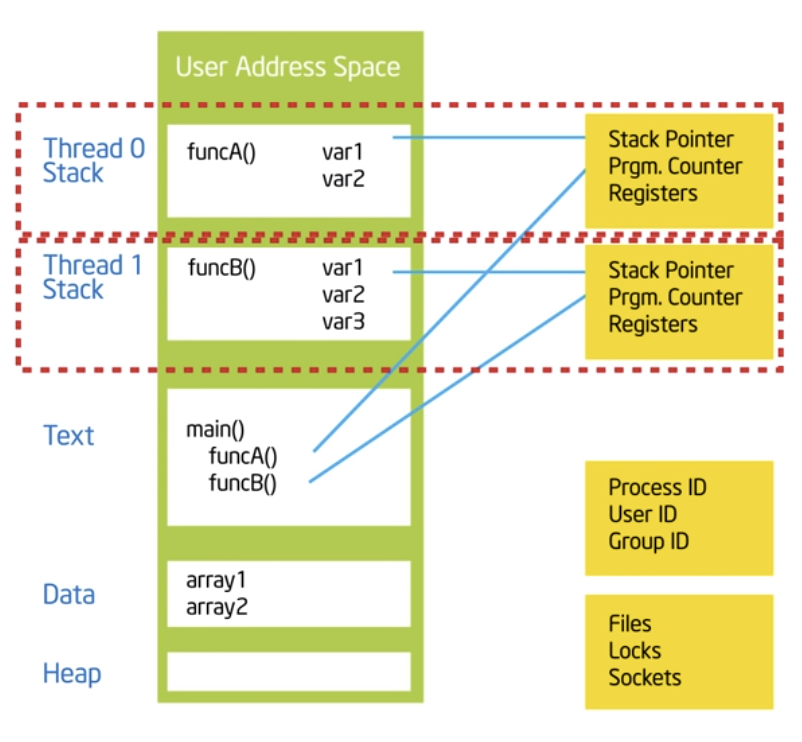
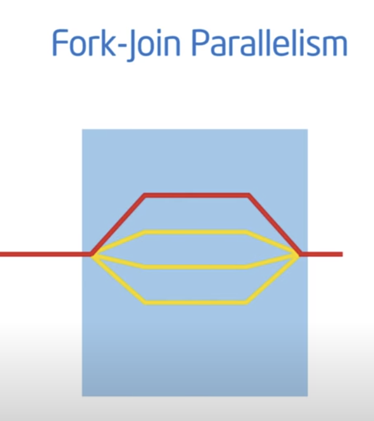
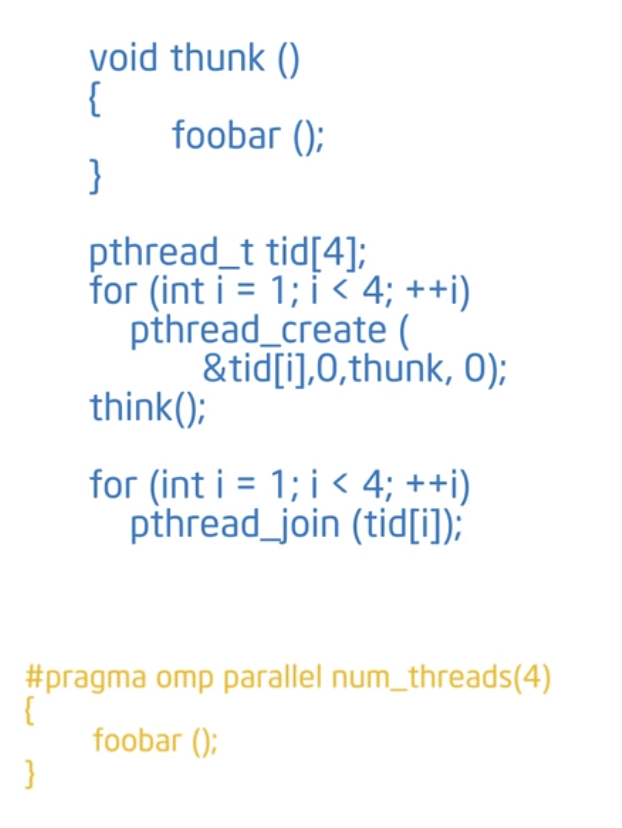
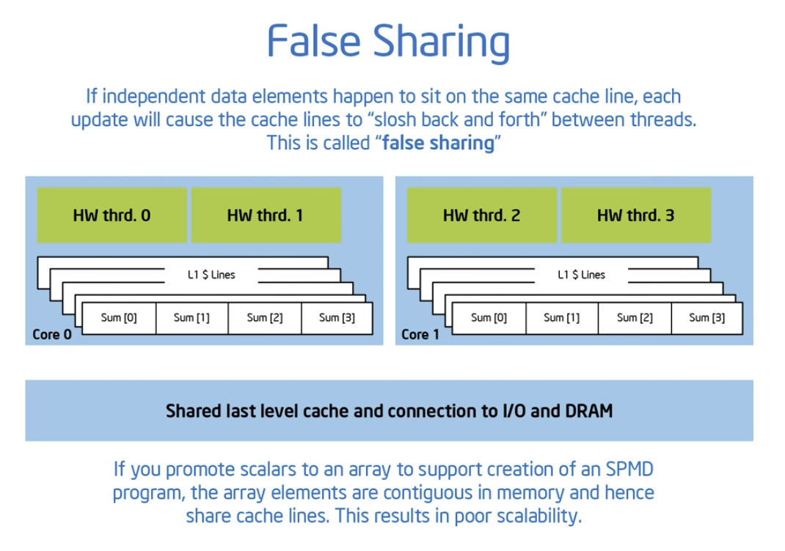

W = CV^2
POWER = W*f
POWER = CV^2f

Concurrency: a condition of a system in which multiple tasks are logically active at one time 
Parallelism: a condition of system in which multiple tasks are active at one time

risolvere un sisitema line are (puo non essere concorrente ma puo usare il parallelismo per eseguire il compito piu velocemente.)
vs 
web server (concurrent by default)

in the image is missing the user layer

Direttive al compilatore e al preprocessore.
#pragma omp contruct[clause[clause]..]
#pragma omp parallel num_threads(4)

#include <omp.h>

molti dei costrutti openMP si applicato a blocchi detti "Structured Block" che sarebbero blocchi di codice da cui una volta che entri non esci se non dalla fine. Non è possibile saltare al centro del blocco o dal centro del blocco all' esterno.

HANDS ON :
to compile with GNU linux an openMP code just run:
gcc -fopenmp foo.c

in bash Shell puoi selezionare il numero di thread da usare per eseguire un programma scritto per openmp:
export OMP_NUM_THREAD=4

OMP suppose that you have a Shared Memory machine
There are 2 kind of shared memory machine:

Symmetric Multiprocessor (SMP):
assume che tutta la memoria e tutti i processori siano uguali non c'è differenza alcuna fra processori ne tempi di accesso in memoria

Non Uniform Memory Access (NUMA) :

poiche ci sono livelli di cache diversi 

I processi nel sistema operativo sono rappresentati in memoria così e poichè i thread hanno l'HEAP condiviso (ma non lo stack) con gli altri e il cambio di contesto risulta molto efficiente.

 
see helloworld that shows tha problem of the race condition. To avoid it should sinchronize the thread that is expensive. Too much sinchronization results in no permormance achievement. Bisogna sinchronizzare quanto meno possibile e per farlo bisogna fare attenzione ai dati e variabili condivise.

4 basic catecories presenti in Open MP 
- creare thread che lavora in uno ambiente shared adresss
- unintendetd shared per evitare casini con le variabili e le races condition
- sinchronization to have organized e disciplined way to access ai dati shared
- organizzare i dati in modo da cercare di ridurre al minimo la sinchronizzazione 

## Costrittu di OpenMP

Creazione di thread in OpenMP:
modello Fork-Join-Model -> praticamente lo stesso di quando accade usando pthread

Quando un processo è in esecuzione questo teocicamente puo creare un set di thread che prendono il nome di thread team. Questo thread of team lavora assieme in condivisione della memoria ed esposto a RC ecc finche poi non si riunisce nello stesso processo di nuovo. Questo processo puo essere ripetuto per ogni pezzo di programma che richide l' azione di piu thread per essere eseguito efficientemente.

ogni thread in generale puo creare altri thread se il sistema ha capacità.

Per fare il fork e creare altri thread in OpenMP si fa UNICAMENTE con la direttiva: 
#pragma omp parallel 

se non c'è nel codice allora tutto è fatto nello stesso thread.

omp_set_num_thread(4);
richiede 4 thread ma non li crea è la direttiva #pragma omp parallel che li crea effettivamente

#pragma omp parallel
{
    int ID = omp_get_thread_num();
    pooh(ID,A);
}

facendo così ogni thread creato con pragma eseguirà il codice all interno delle parentesi.

Dal punto di vista della mamoria tutto ciò che è allocato dentro le parentesi è allocato all nello stack privato del singolo thread mentre tutto ciò che è allocato fuori è allocato (diciamo )nello HEAP ed è condiviso.

Quello che fa openMP è prendere il codice e convertirlo in una funzione in questo caso di nome thunk come nell esempio:

astraendo i dettagli di utilizzo della libreria POSIX thread.

Lo snippet 1 mostra come se il problema è parallelizzabile e non c'è dipendenza fra le operazioni da eseguire è possibile splittare il lavoro fra i thread in funzione del ID, raccogliere i risultati in un array e poi comporre il tutto a posteriori senza usare variabili condivise. Questo è anche un modo di ridurre la sincronizzazione a spesa dell uso di piu memoria.

ATTENZIONE:
Lo shnippet 1 produce su alcune architetture il seguente problema:
in codice non parallelo impiega: 1.83s  

é possibile notare che l introduzione di overhead da parte di OpenMP incrementa il tempo di prestazione nel caso di singolo thread. Mentre comparando il caso con 2 thread e quello con 3 thread si nota un fenomeno di inversione, il tempo aumento con 3 thread anzichè diminuire come ci si aspetta. 

Questo fenomeno prende il nome di Fake Sharing.  

Questo fenomeno è legato al fatto che effettivamente la memoria non è tutta condivisa ma esistono diversi livelli di cache che si sincronizzano garantendo il risultato finale e questo fa si che la scalabilità del programma fallisca. 

Un principio della programmazione parallela recita che è bisogna garantire che i thread scrivano e leggano su dati diversi in modo che questi dati possano esser portati in cache senza dare problemi di sincronizzazione.

Lo snippet 2 mostra come risolvere il problema del fake sharing trasformando un array in una matrice.

Tuttavia il codice proposto è verboso e articolato e dunque si cerca una soluzione molto piu elegante.

Flussi di esecuzione e sinchronizzazione:

High Level sinchronization:
    - Barrier 
        at some point all thread stop and wait till everyone arrive.
        > #pragma omp barrier
        all thread should reach the barrier before to continue.
    - Critilcal
        implement a mutual exclusion
        thread can execute the code just one at a time.
        > #pragma omp critical {}
        just one thread can go forward 
    - Atomic
        > #pragma omp atomic
        for keep it simple: ci sono certi costrutti supportati in hardware che permettono una efficiente mutua esclusione, se ci sono usali se no usa una Critical section in genere usati per semplici operazioni come incrementi o decrementi
    - Ordered

Low Level sinchronization:
    - flush
    - Locks (simple and nested)

Esercizio 3